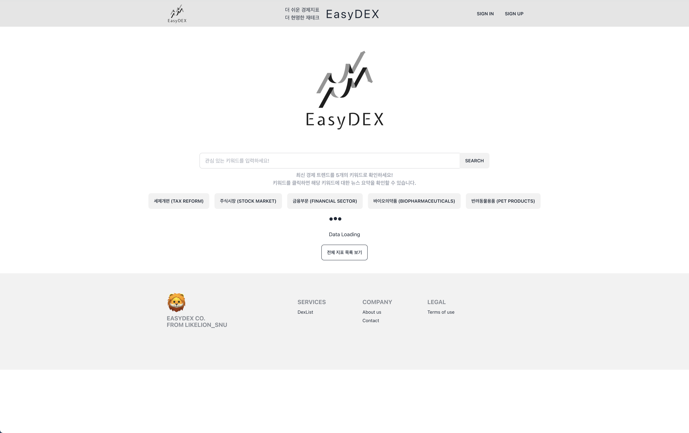
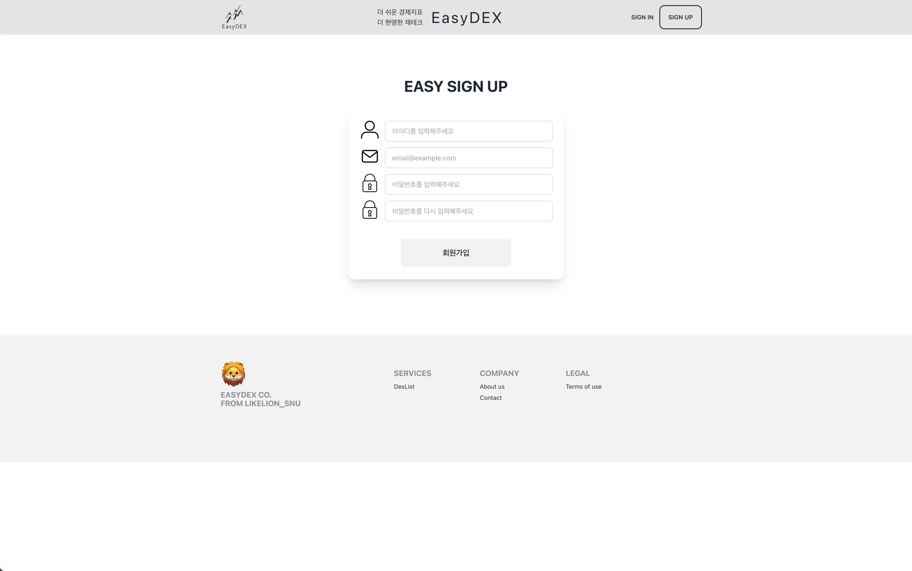
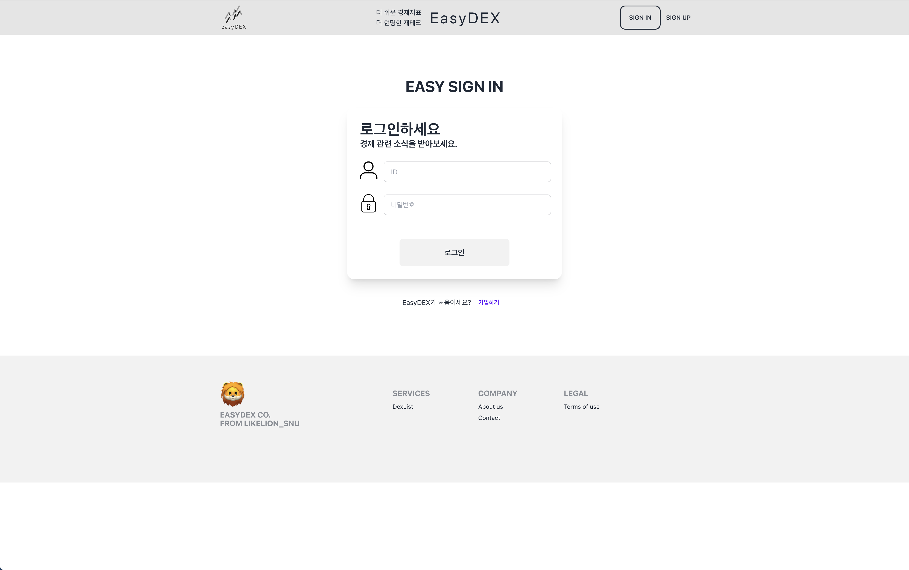

## EasyDex Server
- 2023 멋쟁이사자처럼 SNU 11기 해커톤 프로젝트
- 주식 초심자들을 위한 투자 & 경제지표 통합 제공 서비스
- "경제의 나무위키"를 목표로 사용자 친화적 UI 및 데이터 크롤링 설계

### Table of Contents
1. [프로젝트 소개](#Project-Overview-&-Views)
2. [사용 기술](#Tech-Stacks)
3. [팀원 구성](#People)

### Project Overview & Views
 |  | 
--|--|--

> 서버 및 크롤링 데이터 복구 진행 중입니다(24.04.02.)

Yahoo Finance, Investing.com 등 다양한 투자 지표 모음 사이트들이 존재하지만, 초심자를 위해 간편한 UI와 직관적인 설명 및 지표 간 관계성을 보여주기에는 부족합니다. 이를 해결하기 위해 EasyDEX가 개발되었습니다.

투자를 위한 기본 지표 및 세계 경제 현황을 파악할 수 있는 주요 지수 30개를 선정하여 제공합니다. 각 지수 간의 최근 추이를 토대로 계산한 상관관계를 바탕으로 하나의 지표를 검색했을 때 연관성이 높은 지표들이 같이 노출되게 하였습니다. 

👉 [투자지수 명세](https://ablaze-antlion-2ba.notion.site/da5ccce33a114be0b6375e0fabe73fd4?v=d2c8f51dea094faf88158d8dbc599b89)

상기 주요 투자지수의 경우 오픈 소스 웹 크롤링 프레임워크 [Scrapy](https://scrapy.org/)를 활용하여 [Investing.com](https://www.investing.com/)의 정보를 수집합니다. `BeatifulSoup`로 단순 HTML 문서를 파싱하는 것을 넘어 파이프라인을 통해 데이터를 처리하고 저장하기 위해 Scrapy 프레임워크를 도입했습니다.

***Scrapy Architecture***


***Project Code***
```python
# django/dexmanager/views.py
def post(self, request, dex_id):
    srcDex = SrcDex.objects.get(id=dex_id)
    url = srcDex.url
    try:
        # 해당 url에 대한 크롤링 실행
        subprocess.call(f"cd scraper && scrapy crawl indexhistory -a URL={url} --nolog", shell=True)
        print("Crawling index {} done at {}".format(dex_id, datetime.now()))
    except Exception as e:
        print(e)
        return Response({"detail": "Error scraping data."}, status=status.HTTP_500_INTERNAL_SERVER_ERROR)
    return Response({"detail": "Database updated."}, status=status.HTTP_200_OK)
```
```python
# django/scraper/scraper/pipelines.py
class IndexPipeline:
    def process_item(self, item, spider):
        caller_spider = spider.name
        if caller_spider == 'indicesinfo':
            ...  
        elif caller_spider == 'indexhistory':
            ...
        else:
            ...

        return item
    
    def open_spider(self, spider):
        log.info("Opening Spider: {}".format(spider.name))
        
        
    def close_spider(self, spider):
        log.info("Closing Spider: {}".format(spider.name))
```
```python
# django/scraper/scraper/spiders/crawler.py
class IndicesInfoSpider(scrapy.Spider):
    name = "indicesinfo"
    start_urls = ...

    def parse(self, response):
        ...

class IndexHistorySpider(scrapy.Spider):
    name = "indexhistory"
    
    def start_requests(self):
        yield scrapy.Request(f"{self.URL}-historical-data", self.parse)

    def parse(self, response):
        ...

class HankyungSpider(scrapy.Spider):
    name = "hankyung"
    start_urls = ...

    def parse(self, response):
        ...

    def parse_article(self, response):
        ...
```

웹에서 수집한 지표 이외에도 한국은행에서 제공하는 Open API인 ECOS API를 활용하여 다양한 경제 통계 정보를 수집하고 제공합니다.

👉 [ECOS 데이터 목록](https://ablaze-antlion-2ba.notion.site/openAPI-ab1c14780bf8477a84d40857435089c6?pvs=4)

또한 한국경제 온라인 페이지에서 최신 헤드라인을 가져와 OpenAI API를 활용해 제목을 요약한 키워드를 추출합니다. 효율적인 프롬프팅을 위해 `langchain` 프레임워크 및 하기와 같은 프롬프트 엔지니어링을 사용했습니다.

```python
from langchain.chat_models import ChatOpenAI
from langchain.chains.summarize import load_summarize_chain
from langchain.document_loaders import TextLoader
from langchain.text_splitter import RecursiveCharacterTextSplitter

prompt = f"""
    You are a financial AI assistant that provides recent topic of investing news for Korean briefly.
    Here each line is the latest economic news summary:\n{summary}\n

    Read the latest economic news summary above, and then pick only 5 important keywords affecting the stock market. After then, provide it with explanation obeying following features.
    - When you choose a keyword, you shouldn't be biased at the beginning of the text: Read the whole lines.
    - Each keyword must be less than 10 tokens.
    - Each line must include only one keyword.
    - We are not interested in the information which is not related to investment.
    - Include specific trends reflected in the indicators as much as possible.
    - Exclude propositional particles and political keywords.
    - Your answer is better when the explanation is more specific.
    - Your answer must be only in Korean in both keyword and explanation. The keyword and explanation for each keywords could be just one sentence in Korean. You MUST EXCLUDE additional English Explanations.

    """
```

***Main Features***
- 투자 및 경제 지표 시각화 블록 제공
- `pandas` 라이브러리를 통한 지수 간 상관관계 분석 및 연관도 기준 블록 표시
- 관심 지수 저장 및 관리 (로그인 시)
- 전체 지수 목록 검색
- 한국경제 헤드라인을 통한 AI 경제 키워드 요약 제공

### Tech Stacks


<br>


### People
<table>  <tr>  <td></td> <td>이수혁</td> <td>한진모</td></tr> <tr> <td>GitHub</td> <td><a href="https://github.com/isuh88"></a></td> <td><a href="https://github.com/WiFiHan"></a></td> </tr> <tr> <td>Role</td> <td>데이터 크롤링, 경제지표 API</td> <td>User API, OpenAI API</td> </tr> </table>
